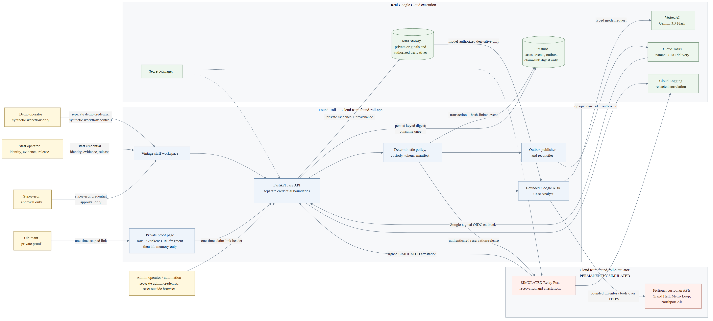
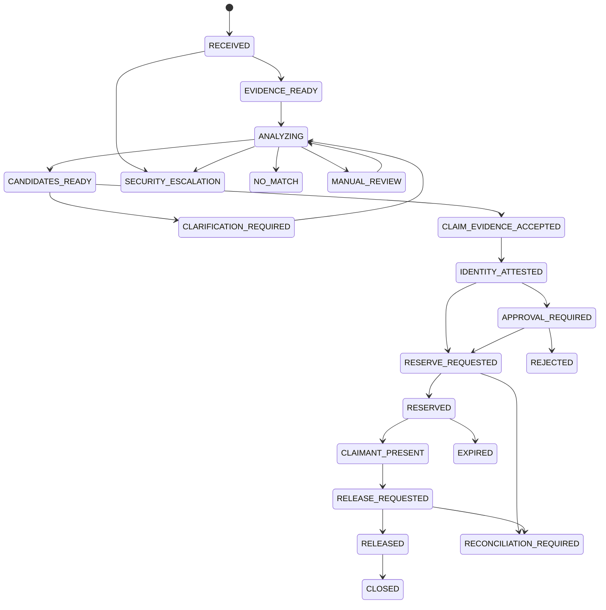

# Found Roll architecture

Found Roll is a policy-bound recovery workflow for property that falls between separate lost-and-found inventories. The model is deliberately not the release authority: Gemini and Google ADK inspect authorized evidence and propose the next evidence action, while typed application code owns policy, custody, credentials, and every state transition.

This document describes the canonical Google Cloud deployment. Local development can replace Firestore, Cloud Tasks, Vertex AI, and the relay HTTP boundary with explicit fixture adapters. Fixture mode is useful for tests; it is not acceptable evidence for the canonical hackathon demo.



The rendered diagram is generated from [`architecture-diagram.mmd`](architecture-diagram.mmd). [`architecture-diagram.manifest.json`](architecture-diagram.manifest.json) binds the checked source and PNG hashes plus renderer version. Keep all three and the implemented adapters in sync before recording or submitting.

## System view

The checked PNG above is the single system-level architecture diagram; the earlier inline duplicate was removed so it cannot drift from the rendered, hash-bound source. The browser never writes custody events or restricted evidence directly. Production rich reads and staff actions require the staff credential, approval requires the supervisor credential, and ordinary synthetic workflow mutations require the demo credential; intake, claimant-link issuance, and duplicate release-task delivery require both demo and staff. A strict non-mutating bootstrap probe validates all three before the staff projection loads. The service then derives the exact configured staff or supervisor actor ID; conflicting optional legacy actor fields fail closed. The claimant receives only a purpose-built coarse projection through a one-time case/version-scoped link, never a staff passport, event, candidate, or manifest response.

## Authority boundary

| Component | May do | Must never do |
| --- | --- | --- |
| Case Analyst, implemented with Google ADK and Gemini | Read the already-authorized candidate packet, compare multimodal evidence, submit source-linked observations, rank candidates, choose a restricted attribute identifier, and draft one non-leading question | See the expected private answer; accept claim evidence; attest identity; approve, reserve, release, or close an item; mint or consume credentials; write custody state |
| Deterministic policy engine | Evaluate hard filters, evidence sufficiency, risk tier, staff attestation, approval, freshness, and token state | Interpret images or invent evidence |
| Custody service | Validate typed commands and state versions, transact state and outbox rows, append hash-linked events, dispatch work, reconcile service attestations, and build a manifest | Treat model confidence or a simulator response as proof of ownership or physical possession |
| Human claimant | Supply the minimum private fact requested | Browse candidates or staff-only evidence |
| Staff and supervisor | Record a minimal identity-check attestation and approve a valuable-item handoff | Delegate the approval decision to the model |
| `found-roll-simulator` | Expose fictional custodian inventories and a real HTTPS reservation/attestation contract for the synthetic fixture | Claim to be an independent airport, transit operator, courier, locker, or source of physical proof |

The Case Analyst output is constrained by a typed schema. `evidence_sufficient_for_claim` crosses the Vertex boundary as a strict JSON boolean and deterministic typed validation accepts only `false`; deterministic code performs any later claim-evidence acceptance after an exact keyed-digest comparison and all hard gates.

## Canonical event flow

```mermaid
sequenceDiagram
    participant S as Staff workspace
    participant A as Found Roll app
    participant F as Firestore
    participant T as Cloud Tasks
    participant G as ADK + Gemini
    participant C as Claimant proof
    participant R as SIMULATED relay

    S->>A: Safe intake with idempotency key
    A->>F: RECEIVED then EVIDENCE_READY
    A->>F: ANALYZING plus outbox row
    A->>T: Named opaque task with case_id and outbox_id
    T->>A: OIDC-authenticated /tasks/outbox
    A->>G: Authorized evidence packet
    G-->>A: Ranked candidates and next-question proposal
    A->>F: CLARIFICATION_REQUIRED
    A-->>C: One non-leading private question
    C->>A: Private answer through isolated proof surface
    A->>F: Keyed digest match plus policy evaluation
    S->>A: Identity attestation, then supervisor approval
    A->>F: RESERVE_REQUESTED plus outbox row
    A->>R: Authenticated reservation request
    R-->>A: Signed SIMULATED HELD attestation
    A->>F: RESERVED
    S->>A: Present custodian credential
    C->>A: Present claimant credential
    A->>R: Authenticated credential presentations
    R-->>A: Signed SIMULATED token attestations
    A->>F: CLAIMANT_PRESENT
    S->>A: Staff-confirmed release intent
    A->>R: Authenticated release request
    R-->>A: Signed SIMULATED RELEASED attestation
    A->>F: RELEASED then CLOSED; build manifest
```

Cloud Tasks and remote callbacks are treated as at-least-once. A transaction writes the requested transition and deterministic outbox record together. The named task carries opaque identifiers only. Cloud publication and replay receipts expose the task name/status but no body; the local inline adapter may return the same three-field opaque body so the development client can deliver it explicitly. A duplicate completed task updates its replay audit fields and returns `replayed=true` without appending a second custody event; an exact duplicate callback returns its prior accepted result, also without a second event. A stale case version, stale remote eTag, missing or invalid attestation, or unknown remote outcome cannot advance the workflow and instead enters a review or reconciliation path.

For the canonical recording, the authenticated preparation script performs the reset and current-epoch evidence upload before the browser opens. The presenter demonstrates the local safety/no-upload branch and cancels it, then starts analysis on that already prepared frozen case. This keeps reset, evidence provenance, and the filmed passport on one workflow epoch instead of silently switching to a dynamically created intake.

## Custody state model



Visual similarity never reaches `CLAIM_EVIDENCE_ACCEPTED`. For the valuable camera-pouch fixture, accepted private evidence, a staff identity attestation, and supervisor approval are all required before `RESERVE_REQUESTED`.

## Evidence and visibility

| Class | Examples | Allowed readers | Storage rule |
| --- | --- | --- | --- |
| Public/coarse | Item category, broad color/material, coarse found zone, approximate time window | Authorized staff and the bounded search adapter; only deliberately selected fields may reach claimant copy | Firestore fields or derived preview; no restricted answer |
| Restricted claim evidence | Serial fragment digest, exact identifying mark, staff-only detail image | Custody service and authorized staff; the model receives only an attribute identifier when possible | Restricted Firestore field or private Cloud Storage object; never logged or placed in a task payload |
| Original media | Intake image, staff detail image, provenance | Authorized staff service path only | Private Cloud Storage object with generation and SHA-256 recorded |
| Derived media | EXIF-stripped preview or crop | Authenticated staff UI and model request for the current case | Separate object linked to its source digest and workflow epoch; only the latest complete current-epoch pair is active; never overwrite the original |
| Identity evidence | Method, staff actor, outcome, timestamp | Authorized staff and manifest reviewer | Attestation metadata only; the demo stores no ID image |
| Credential | Claimant/custodian one-time value | Holder at issuance or presentation | Only an HMAC digest is persisted; short expiry and one-time consumption |

The event chain is application-enforced and internally checkable. It is not an immutable third-party ledger: a Google Cloud administrator with sufficient IAM could change Firestore data. The manifest therefore proves internal service-event consistency, not physical custody, ownership, or a real-world transfer.

Evidence upload is retry-safe within one workflow epoch. The case, epoch, idempotency key, content digest, and model-consent decision bind deterministic original/preview records. An exact retry returns the existing pair; conflicting bytes or consent fail closed. A reset may retain older private objects, but neither the model nor the staff workspace selects them. When no active current-epoch preview exists, the workspace shows unavailable media instead of an unrelated fixture image.

## Real and simulated boundary

| Element | Required canonical-demo state | What it proves | What it does not prove |
| --- | --- | --- | --- |
| Gemini evidence analysis | Live Vertex AI calls using the pinned configured model, bound in all five private `v1.0.0` run receipts | A model inspected the authorized synthetic evidence and returned a typed proposal | Match accuracy outside the published fixture set; release authority |
| Google ADK | Live bounded agent/tool trajectories, with sanitized run and invocation evidence in all five release receipts | The model used the permitted evidence-planning workflow | Independent agent governance or a multi-agent system |
| Cloud Run, Firestore, Cloud Storage, Cloud Tasks, Cloud Logging | Exact source-deployed revisions in the dedicated Free Trial project, bound by the private release and privacy receipts | Network execution, durable state, retried work, and request-log correlation for the shown case | Production scale, regulatory compliance, or zero-operator operation |
| Policy, state versioning, idempotency, token consumption, manifest | Real frozen application code with five recomputed 19-event chains and deliberate replay checks | The shown transition sequence follows the frozen rules and replays do not duplicate effects | Correctness beyond the tested contracts or immunity from a project administrator |
| Grand Hall, Metro Loop, Northport Air | Fictional simulators with synthetic inventory | One adapter can query isolated namespaces through real HTTPS | A live venue, transit, or airport integration |
| Relay Post | Separately deployed on Cloud Run and permanently labeled `SIMULATED` in the five canonical workflows | Reservation, expiry, credential presentation, signed callback, and replay handling over a real API boundary | A real courier, locker, handoff, ownership check, or physical possession |
| Fixture photographs and route history | Synthetic | A reproducible privacy-safe scenario | Real claimant data or real-world prevalence |

Do not record the canonical demo in local fixture mode. The recording must show the model run ID and configured model, both Cloud Run revisions, the Firestore passport mutation, the Cloud Task, and a trace/correlation ID from the same reset run.

## Deployment modes

| Mode | Repository | Analyst | Tasks | Relay | Permitted use |
| --- | --- | --- | --- | --- | --- |
| Unit/integration tests | In-memory | Deterministic fixture | Inline receipt | In-process fixture | Repeatable safety and contract tests only |
| Local connected rehearsal | In-memory or isolated Firestore namespace | Vertex ADK or fixture, explicitly labeled | Inline or development queue | Local HTTP simulator | Development and failure diagnosis; not final proof unless every canonical requirement is live |
| Canonical hackathon deployment | Firestore | `vertex_adk` with pinned `gemini-3.5-flash` | Cloud Tasks with OIDC | Separately deployed authenticated HTTP simulator | Final evaluation run and recorded demo |

Production configuration validation must fail closed if the project, Firestore, live analyst, Cloud Tasks, remote simulator, task service account, or non-default secrets are missing. The exact deployment and verification gates are in [deployment.md](deployment.md).

## Trace and audit correlation

Each canonical run should preserve a small receipt containing the case ID, reset timestamp, submitted commit, fixture version, app and simulator Cloud Run revisions, model name and run ID, task name, trace ID, final event hash, and evaluation output digest. Receipts must contain identifiers and digests only—never private answers, one-time credentials, signed URLs, raw images, or model prompt/response content.
