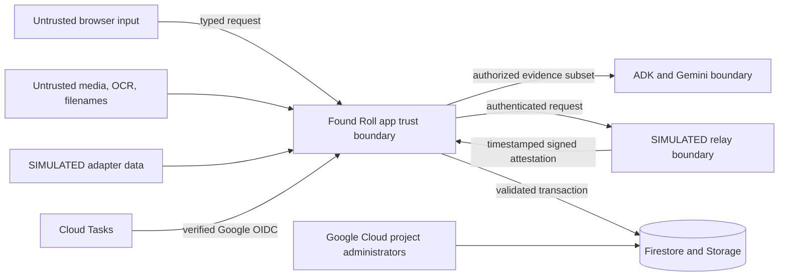

# Found Roll threat and privacy model

Found Roll is a hackathon prototype for synthetic lost-property cases. The design assumes that photos, descriptions, OCR, filenames, claimant answers, adapter data, callbacks, and task deliveries are untrusted. The central safety objective is narrower than “find the right item”: the system must not leak the private fact that separates evidence from a guess, and it must not advance custody from model judgment, stale state, token replay, or an unverifiable simulator result.

This document is a design and verification contract, not a compliance certification. The submission must not accept real claimant or operator data without production authentication, retention, privacy review, incident response, and operator-specific policy work that is outside the hackathon scope.

## Protected assets

| Asset | Harm if exposed or modified | Required control |
| --- | --- | --- |
| Restricted claim-evidence value | Enables a fraudulent claimant to repeat the expected answer | Keep outside model output and claimant/publication views; persist only a keyed digest where possible; Secret Manager pepper; zero log capture |
| Original evidence image and metadata | May reveal exact location, people, device data, or other contents | Private Cloud Storage; no public ACL; EXIF-stripped derivative; generation and digest provenance; authorized service access only |
| Claimant proof link | Allows unauthorized private-answer submission during its lifetime | Raw value only in a scrubbed URL fragment and tab memory; keyed-digest persistence; case/version binding; short expiry; one-time consumption; wrong-answer rotation; no logs |
| Claimant handoff credential | Could create a false service token attestation | High entropy, short expiry, keyed-digest persistence, one-time consumption, case/item/handoff/purpose binding, no logs |
| Custodian credential | Could create a false service token attestation | Same controls as claimant credential plus custodian-purpose binding |
| Staff identity/evidence/release and supervisor approval | Could expose evidence or falsely authorize a valuable-item path | Separate runtime credentials; exact configured actor IDs; minimal metadata; expected case version; actor/reason/timestamp event; no ID image |
| Passport/custody state | Wrongful reservation, release, or closure | Deterministic transition table, transaction, expected version, policy gate, idempotency fingerprint, remote eTag |
| Relay callback | False held/released result or replay | Timestamped HMAC-SHA256 signature, canonical body, freshness window, attestation/schema validation, idempotency record |
| Cloud Task | Unauthorized outbox execution or duplicate work | Google-signed OIDC validation for exact audience and task service account, opaque identifiers, deterministic task name, replay-safe handler |
| Event history and manifest | False audit narrative | Server-only writer, hash-linked sequence, recomputation tests, restricted IAM, explicit non-immutability disclosure |
| Service secrets and IAM identity | Total compromise of evidence, callbacks, or state | Attached service accounts, least privilege, Secret Manager, no service-account keys, rotation and audit |
| Synthetic demo and admin credentials | Unauthorized fixture mutation, reset, or outbox recovery | Separate non-default secrets; constant-time comparison; demo token only on general workflow mutations; admin token never accepted by browser code; synthetic namespace only |

## Trust boundaries



The project-administrator path is intentionally drawn around normal application controls. Firestore Admin SDK access and IAM can bypass browser security rules; a project Owner can also change Cloud Run revisions, secrets, or stored data. Found Roll therefore claims an application-enforced, hash-linked event history—not an immutable or independently anchored ledger.

## Staff, claimant, publication, and restricted evidence

Every fact and asset has an explicit visibility label before it reaches an adapter, the model, the claimant page, or logs.

| Visibility | Examples | Model access | Claimant/publication access |
| --- | --- | --- | --- |
| Coarse/public | Category, broad appearance, coarse zone, approximate time, synthetic tenant name | Allowed when relevant to the current case | Only purpose-built fields; never a raw candidate record |
| Staff | Current holder, storage slot, exact intake provenance, route compatibility, remote eTag | Allowed only when the analyst tool contract requires it | Never |
| Restricted | Serial fragment value/digest, exact hidden mark, unredacted close-up, claimant answer, credential, signed link | Expected value is withheld; an attribute ID or redacted derivative may be used | Never, except that the claimant submits their own answer |
| Operational metadata | Case/version, tool outcome, policy version, task/trace/model run ID, latency, redacted error code | As needed for the bounded run | Staff/status view only; safe identifiers may appear in demo proof |

Original and derived images are different objects. The derived path strips EXIF and any unnecessary metadata. Every crop, blur, or annotation records its source object generation and SHA-256. The application never overwrites an original with a derivative or grants the model bucket-wide browsing. Evidence ingestion is idempotent for an exact retry and scoped to the current workflow epoch. The staff preview and model input use the latest complete original/derivative pair from that epoch; retained objects from an earlier reset remain isolated and are never substituted as active evidence. If the current pair is unavailable, the workspace reports that state rather than showing unrelated fixture media.

Production rich reads for cases, candidates, events, and manifests require staff authentication. Claimants receive a separate, purpose-built projection containing only the fields needed to answer the active proof question. Staff/publication and claimant contracts use explicit response models. Pydantic field exclusion is helpful but is not the sole control: privacy tests search serialized rich-read, publication, validation-error, and claimant responses for restricted field names and canaries.

Sensitive intake routing happens before upload or network work. The category selects a deterministic action/retention rule for passports or government IDs, payment cards, access badges, medication, suspicious packages, or an unknown specialist category; the selected tenant resolves that rule to the Northport Air, Metro Loop, or Grand Hall specialist desk. Every such branch sets upload/model permission false, exposes no file input, creates no case, and calls no model.

## Model and prompt-injection boundary

Uploaded images, OCR, filenames, descriptions, and adapter strings may contain instructions such as “ignore policy,” forged tool output, or a request to reveal another tenant. They are evidence, never instructions.

The Case Analyst receives only proposal tools:

- search an explicitly authorized custodian;
- load an explicitly authorized candidate and permitted evidence fields;
- submit source-linked observations;
- propose a restricted attribute ID and one non-leading question; and
- request manual review with a bounded reason code.

It has no tool for evidence acceptance, identity, approval, reservation, credential issuance, release, closure, tenant administration, IAM, or arbitrary URL fetching. Tool schemas reject extra fields, calls are capped, tenant authorization is checked outside the model, and returned text cannot add permissions. The model does not receive the expected private answer. Any schema failure, prompt-injection signal, unavailable source, or missing private discriminator abstains or enters manual review.

Model confidence may prioritize the investigation queue but cannot satisfy a policy gate. The current service records the model name, model run ID, the single observed ADK invocation ID, a logical ADK model-call count, sanitized tool-name/outcome pairs, and event evidence references without logging raw private prompts or responses. The logical count is derived from unique non-streaming ADK events carrying usage metadata and does not claim to count internal SDK HTTP retries. Tool evidence fails closed unless every response ID and name matches exactly one observed call; arguments, response bodies, token usage, prompts, and model response text are discarded before persistence. Runtime health and snapshots expose only non-secret contract identifiers: `found-roll-case-analyst-prompt-v1`, `found-roll-analysis-proposal-v1`, and `found-roll-release-v1`. The canonical live receipt must bind those identifiers to the submitted SHA-256 values of `service/app/agent_contract.py`, `service/app/domain.py`, and `service/app/policy.py`, plus the observed ADK tool trajectory/source references; those live fields remain unverified until that receipt exists.

## Custody and concurrency controls

Custody state transitions are protected by the applicable combination of:

- the case and intended target state;
- expected current case version;
- actor and reason;
- evidence/event references;
- a bounded idempotency key and request fingerprint;
- policy version and current decision where relevant;
- selected item and remote eTag for relay operations; and
- an occurrence timestamp.

Not every route carries every field above. Intake, evidence ingestion, reset/reconciliation, task delivery, release-task replay, and signed callbacks use their endpoint-specific scope and replay contracts rather than a universal mutation body.

The service derives staff and supervisor actors from the credential that authenticated the request, using the exact configured actor IDs without adding prefixes. Optional legacy actor fields are accepted only when they match that derived actor; a conflict is rejected before mutation.

A Firestore transaction rejects a stale version or invalid transition. A repeated idempotency key with the same fingerprint returns the original result; reusing it for a different request is a conflict. Remote reservation and release use an outbox/saga so committing intent is not mistaken for remote success. A timeout or ambiguous simulator response enters `RECONCILIATION_REQUIRED`; it never invents an attestation.

The simulator item has its own `AVAILABLE → HELD → RELEASED` lifecycle and `HELD → AVAILABLE` expiry path. The app and simulator must agree on case, item, handoff/reservation, operation, expected versions, remote eTag, time window, and `simulated: true` before a response can advance state.

## Credentials, replay, and callback validation

Claimant proof links are separate from the later claimant handoff credential. The service issues a raw `frcl_…` value only while a case is `CLARIFICATION_REQUIRED`, binds its keyed digest to the case and exact issued case version, and persists only digest/lifecycle metadata. The staff surface builds a claimant URL with the raw value in `#claim=…`, so it is not sent as an HTTP query or path. On load the claimant client moves it into memory and immediately removes the fragment with `history.replaceState`; it does not use local or session storage.

Inspection and answer submission send the raw value only in `X-Found-Roll-Claim-Link`. Submission consumes it before answer evaluation. A correct answer leaves no replacement. A wrong answer increments the case version and returns a newly issued link for that version; the consumed/overwritten link cannot be reused. Missing, wrong-case, wrong-digest, stale-version, replayed, and expired links fail closed without revealing the expected answer or stored digest. Theft during the active window remains a residual risk, so the link is not an identity factor.

Found Roll generates separate claimant and custodian one-time credentials with `secrets.token_urlsafe(24)`, giving substantially more entropy than a human code. Only keyed HMAC digests are persisted. The current service caps their expiry at ten minutes or the earlier handoff expiry. Release configuration must freeze and test the actual expiry; UI copy must match it.

A token record binds the digest to one case, item, handoff, and purpose. Consumption checks the binding, unused state, expiry, expected case version, and current custody state in the same protected mutation. The second presentation returns a safe replay error and cannot append another event. Token presentation is described as a service attestation only; it never proves identity, ownership, physical presence, or possession.

Simulator mutations require `Authorization: Bearer <SIMULATOR_API_KEY>` and fail closed when the key is unset. With `SIMULATOR_ENV=production`, the process also refuses to start when the API, token, or callback secret is missing, shorter than 24 characters, a placeholder, or reused across purposes. The API key is acceptable only for this isolated synthetic simulator; production service-to-service integration should use workload identity/OIDC. Raw authorization headers are never logged.

Callback artifacts use:

```text
X-Found-Roll-Simulator-Timestamp: <unix timestamp>
X-Found-Roll-Simulator-Signature: v1=<hex HMAC-SHA256>
```

The app verifies a canonical `timestamp + separator + raw body` construction with constant-time comparison, rejects timestamps outside the frozen freshness window, validates the strict attestation schema, and records the attestation/idempotency ID. A valid duplicate returns the original result without a second event. An invalid or stale callback returns a generic error that does not reveal the expected signature or secret.

Cloud Tasks sends a Google-signed OIDC identity token with the app base URL as audience and `found-roll-tasks@…` as the expected subject/email. The task route verifies signature through Google keys, issuer, audience, expiry, and exact service-account identity. A task-name header is checked for correlation/defense in depth but is considered attacker-controlled on its own. Cloud Tasks publication and replay receipts are payload-free. The inline local adapter may retain its opaque three-field payload (`schema_version`, `case_id`, and `outbox_id`) in a development receipt so the client can deliver it explicitly; neither form contains business or evidence content.

## Identity and human approval

The valuable-item workflow deliberately has two human gates:

- staff records that identity was checked, using an allowed method and minimal outcome metadata; and
- an authorized supervisor approves or rejects the handoff with a reason.

The demo stores no image or number from an ID document. The model cannot call either action. The browser uses three independent runtime boundaries:

- `X-Found-Roll-Demo-Token` for the ordinary synthetic workflow; it is not a role or identity;
- `X-Found-Roll-Staff-Token` for staff-rich reads, evidence, identity attestation, and release confirmation; and
- `X-Found-Roll-Supervisor-Token` only for approval/rejection.

The server maps staff and supervisor credentials to the exact configured `FOUND_ROLL_STAFF_ACTOR_ID` and `FOUND_ROLL_SUPERVISOR_ACTOR_ID`; it does not trust browser-supplied identity or add role prefixes. At bootstrap, the browser runs a strict, non-mutating probe for demo, staff, and supervisor credentials even in development and checks the returned actor IDs. All three must pass before the workspace is marked loaded. Empty, partial, conflicting, or rejected configuration clears the loaded state, credential values, claimant link, pending intake, tokens, outbox/manifest state, and active evidence object URL. Those three values otherwise remain only in tab memory, are sent only to matching endpoints, and are rejected when cross-used. Reset and outbox recovery require the separate `X-Found-Roll-Admin-Token`; the frontend never accepts or stores it, and canonical reset runs from an authenticated terminal or Cloud Shell. These fixture credentials are not production identities. A production system still needs a verified staff identity provider, tenant-scoped role claims, and stronger case-scoped claimant authentication. The limitation remains visible in the README/Devpost, and the submitted service must contain no real claimant, operator, or evidence data.

## Log and trace minimization

Allowed structured fields are limited to:

- case ID, passport version, event ID/type, task/outbox ID, trace/correlation ID;
- model, prompt, schema, and policy version identifiers;
- tool name, outcome, latency, retry count, and redacted error code;
- service/revision and simulator attestation ID; and
- aggregate fixture/evaluation status.

Forbidden log, trace, error, metric-label, or task fields include:

- private answers or their normalized form;
- raw one-time credentials, claimant links, authorization headers, cookies, session IDs, callback secrets, or signatures;
- signed Cloud Storage URLs or private object contents;
- model prompt/response or tool-content capture;
- raw descriptions, OCR, filenames, addresses, identity text, serials, or extracted EXIF;
- request or response bodies on evidence/claim/token routes; and
- high-cardinality secret-adjacent values in span attributes.

Validation errors report field paths and generic schema messages only. They never echo the request body. Exception handlers must not interpolate an answer, token, signed URL, request headers, or model content.

## Privacy and log scan

Every canonical run exports the exact app/simulator log and trace time range into a release-only artifact, then scans it together with purpose-built claimant responses, staff/publication surfaces, task receipts, screenshots, and repository publication artifacts.

The scanner input manifest contains synthetic canaries and forbidden patterns. Store that manifest outside claimant/publication assets and identify it in reports by SHA-256, not by printing its values. Required pattern classes include:

- every fixture restricted-answer and serial canary;
- raw claimant and custodian test credentials;
- `Authorization`, `Bearer`, `token=`, common signed-query parameters, and callback-signature values;
- private bucket/object paths and signed URL shapes;
- long unexpected URL-safe strings in errors or logs;
- ID-document field labels, exact addresses, EXIF GPS labels, and raw claimant text; and
- restricted Pydantic/domain field names on claimant or staff/publication surfaces.

The scan receipt must state the submitted commit, both Cloud Run revisions, case IDs, UTC start/end, log filter, trace export range, manifest digest, files examined, match count, manually reviewed false positives, and final finding count. The release gate is zero unresolved findings. A scanner that did not cover Cloud logs/traces and rendered artifacts is incomplete.

An example export shape, with no secret values on the command line:

```powershell
$StartUtc = "<canonical-run-start-rfc3339>"
$EndUtc = "<canonical-run-end-rfc3339>"
gcloud logging read "resource.type=cloud_run_revision AND timestamp>=\"$StartUtc\" AND timestamp<=\"$EndUtc\" AND (resource.labels.service_name=\"found-roll-app\" OR resource.labels.service_name=\"found-roll-simulator\")" --format=json --project=$ProjectId
```

Redirect the export only into the private evaluation artifact directory, never into `public/`. Use an automated scanner script if present; otherwise the evaluation status remains `INCOMPLETE` rather than relying on a visual skim.

## Admin and IAM boundary

Browser security rules do not constrain the Firestore Admin SDK. The primary controls are:

- dedicated app, simulator, and task service accounts;
- no Owner/Editor roles on runtime identities;
- app-only access to the Firestore namespace and evidence bucket;
- bucket-scoped object role rather than project-wide storage administration;
- app and simulator access only to the secrets each consumes;
- eight named Secret Manager resources: service digest pepper, demo access, admin recovery, staff evidence/identity/release, supervisor approval, simulator API, simulator token hashing, and simulator callback HMAC;
- task identity limited to invoking the task handler and no datastore access;
- simulator runtime with no Firestore, Storage, Vertex, or Cloud Tasks role;
- deployment identity separate from runtime identities; and
- Cloud Audit Logs plus a frozen revision/config receipt.

Because a sufficiently privileged administrator can modify data or code, the event hash chain detects ordinary inconsistency but cannot defend against a coordinated rewrite by that administrator. Public materials must retain this limitation.

## Simulator disclosure

`SIMULATED` is not a small footer disclaimer. It is permanent in the simulator window title/banner, API health/body metadata, reservation provider name, attestation schema, event reason, manifest disclosure, demo opening card, Devpost copy, and architecture diagram.

The allowed claim is: “Found Roll called a separately deployed simulator over a real authenticated HTTPS contract and safely reconciled its signed, replay-protected service attestation.”

The forbidden claim is: “A courier, locker, airport, or custodian confirmed the real item or physical handoff.”

Grand Hall, Metro Loop, Northport Air, Relay Post, inventory records, claimant history, staff identities, route, images, and credentials are synthetic. Do not reuse real organization logos, names, forms, or personal data in the canonical fixture.

## Abuse and failure cases

| Threat/failure | Required response | Residual limitation |
| --- | --- | --- |
| Fraudulent claimant guesses from public copy | No public candidate catalog; one non-leading question; keyed answer comparison; bounded wrong-attempt escalation; manual review | A claimant may know the private fact through legitimate sharing; human approval remains important |
| Claimant-link theft or replay | Raw link only in a scrubbed fragment/tab memory; keyed-digest persistence; case/version/expiry binding; one-time consume; wrong-answer rotation; safe invalid/replayed/expired errors | A stolen active link can submit one answer; the link is not identity proof |
| Cross-tenant enumeration | Server-side allowed-peer check and coarse result contract; no arbitrary tenant/tool parameter from the browser | Simulator tenants do not prove production multi-tenant isolation |
| Prompt injection in evidence | Treat all content as data, fixed system/tool permissions, typed output, call cap, manual-review fallback | Model robustness is evaluated only on synthetic canaries |
| Duplicate task/callback | Deterministic names, idempotency fingerprint, strict attestation ID; a duplicate task updates replay audit metadata with no new custody event, while an exact callback replay returns its prior result | Regional service outages can delay recovery and require reconciliation |
| Token theft | Short expiry, purpose/case/handoff binding, hash-only persistence, one-time use, no logs | During its short lifetime, a stolen raw token can be presented; it is not an identity factor |
| Callback forgery | Secret Manager HMAC, timestamp freshness, constant-time compare, strict body schema | Shared-secret compromise requires immediate rotation and replay audit |
| Stale concurrent staff action | Expected case version and transactional transition | User must refresh and reassess rather than forcing the write |
| Admin tampering | Least privilege, audit logs, hash-chain recomputation, frozen deploy receipt, honest non-immutability wording | Project administrators remain a trusted boundary |
| Public demo abuse | Synthetic-only data, `_synthetic_demo` namespace, separate demo/admin credentials, bounded admin recovery, instance caps, reset/idempotency, no real data | A shared demo credential is not production identity or claimant authorization; no request-rate limiter is claimed |

## Retention and deletion

The canonical project uses synthetic fixture data only. Keep the submitted fixture and judge-visible revision stable through the judging window, then delete the isolated evaluation namespace, evidence bucket objects, one-time link records, simulator state, secrets, and public demo access under a recorded teardown plan.

Firestore TTL is cleanup, not a synchronous security control. Code checks expiry before any action. Cloud Tasks delivers queued work, while bounded cancellation/expiry logic and the admin reconciliation route remain application responsibilities. For a future real deployment, each tenant/category needs an approved retention and appeal window; claimant evidence should be deleted or anonymized when the case and appeal window close. Sensitive categories need specialist policies rather than ordinary demo retention.

## Incident stop procedure

Pause the Cloud Tasks queue and stop canonical recording immediately if any of these occurs:

- a private answer, raw credential, signature, signed URL, or media content appears in logs or public output;
- an unauthenticated task/callback/mutation succeeds;
- a stale version/eTag or duplicate delivery causes a second side effect;
- the simulator omits `SIMULATED` or an event/manifest implies physical proof;
- a model/tool receives an unauthorized tenant, restricted answer, or custody-changing capability; or
- the event chain or manifest fails recomputation.

Preserve the failed-run receipt. Rotate affected secrets through Secret Manager, deploy a corrected revision, reset only the isolated synthetic fixture namespace, rerun the full security negatives and privacy scan, and complete five new canonical runs. Never delete failure evidence or relabel a fixture-mode run as live.

## Release checklist

- [ ] Synthetic-only data and asset provenance are frozen.
- [ ] Staff-rich, purpose-built claimant, publication, and restricted response contracts have snapshot tests.
- [ ] Dangerous pre-intake creates no record, image, task, or model call.
- [ ] Sensitive category/tenant combinations return the intended specialist no-upload route with no request or record creation.
- [ ] Model tools are proposal-only and expected private values are absent from model input/output.
- [ ] State/version/eTag, policy, identity, approval, and token gates are deterministic.
- [ ] Task OIDC verification checks signature, issuer, audience, expiry, and exact task service account.
- [ ] Simulator revision sets `SIMULATOR_ENV=production`; API, token, and callback secrets come from Secret Manager and fail startup when missing, weak, placeholder, or duplicated.
- [ ] All eight secret resources exist; demo, admin, staff, supervisor, simulator API, simulator token, callback, and pepper values are mapped only to their consumers.
- [ ] The strict non-mutating runtime probe validates demo, staff, and supervisor credentials before the browser loads; missing, partial, wrong, and cross-used configurations fail atomically.
- [ ] Staff and supervisor actor IDs are distinct, server-derived exact configured values; conflicting optional legacy IDs fail before mutation.
- [ ] Claimant links are case/version scoped, digest-only at rest, fragment/tab-memory only in the browser, expiring, one-time, and rotated after a wrong answer.
- [ ] Timestamped callback HMAC and replay behavior have negative tests.
- [ ] Raw tokens are high entropy, short-lived, hash-only at rest, purpose-bound, and one-time.
- [ ] App/simulator service accounts have least privilege and no key files exist.
- [ ] Cloud Storage originals/derivatives are private, separate, provenance-linked, EXIF-stripped, exact-retry safe, and current-workflow-epoch scoped; the preview never substitutes unrelated fixture media.
- [ ] The canonical inventory health receipt records production mode and legacy health compatibility disabled.
- [ ] Five fresh canonical runs pass without manual database repair.
- [ ] Log/trace/public/artifact scan has zero unresolved findings.
- [ ] Devpost, README, UI, architecture, demo, and manifest repeat the real-versus-simulated limitation exactly.

The current local suites cover prompt-injection text as inert evidence and reject expired claimant links with zero event delta, but this checklist remains open until a frozen live Gemini/ADK/Google Cloud run and its privacy artifacts exist.
